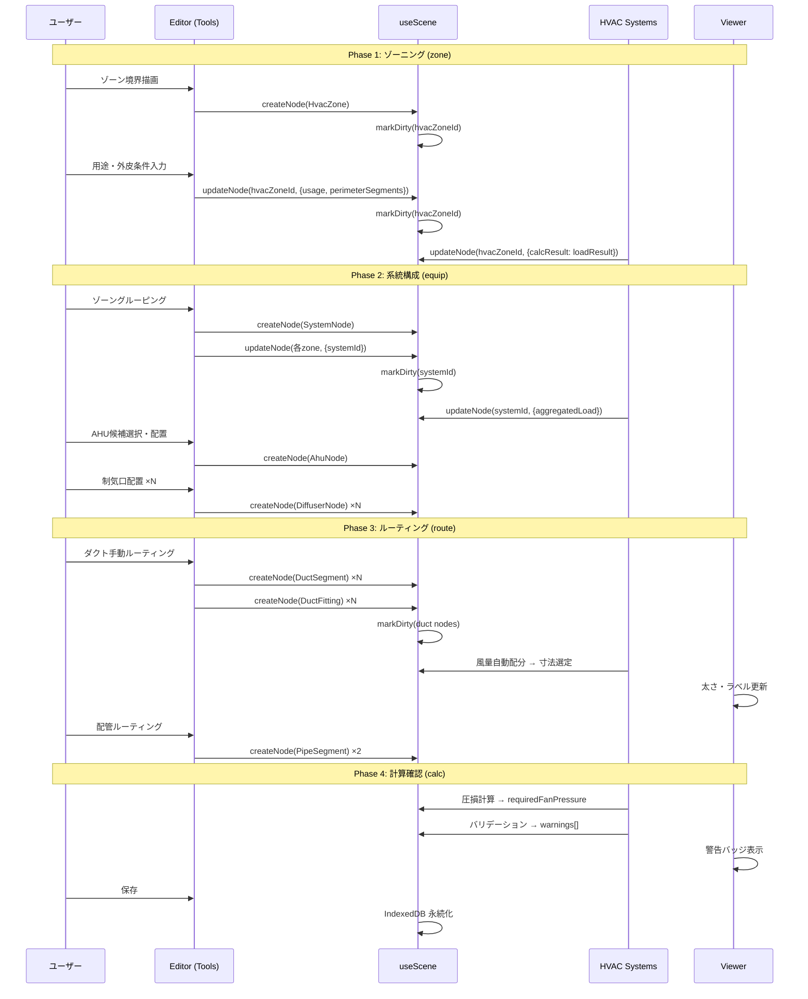
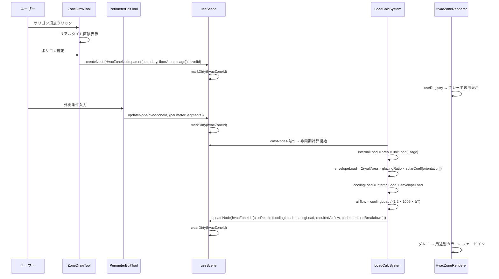
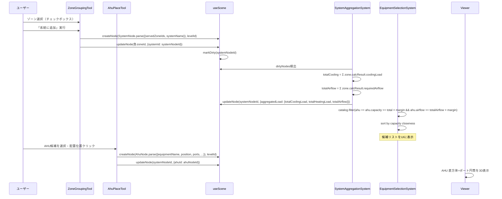
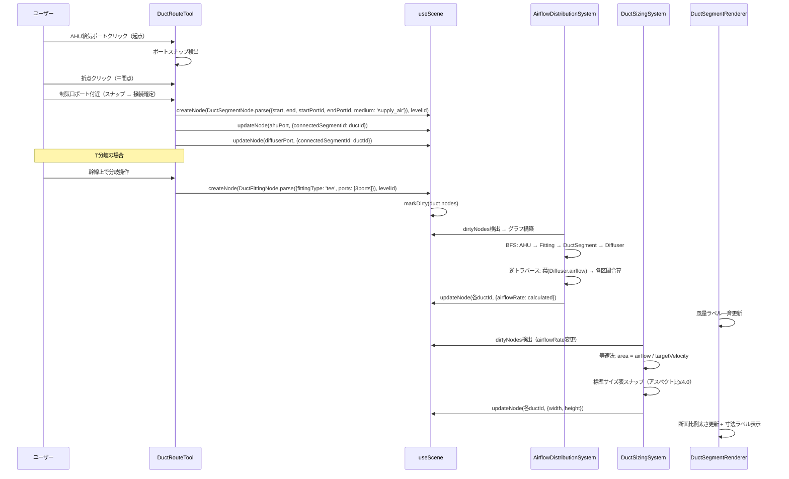
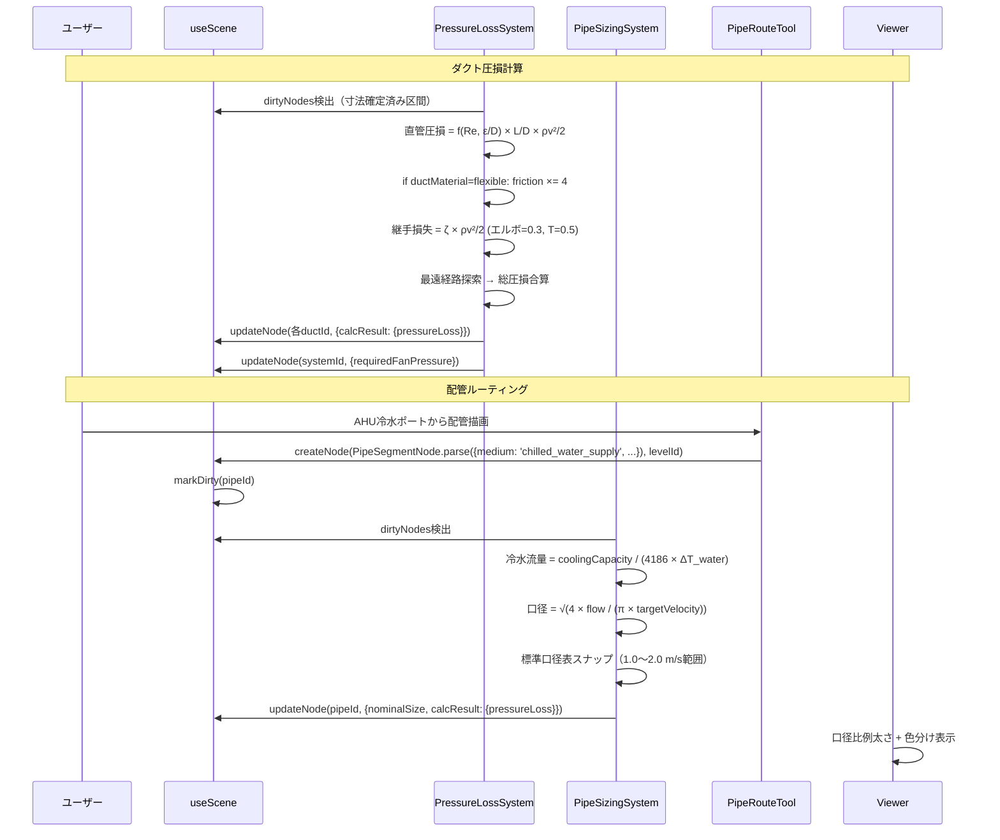
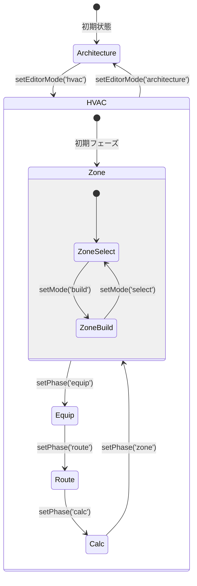
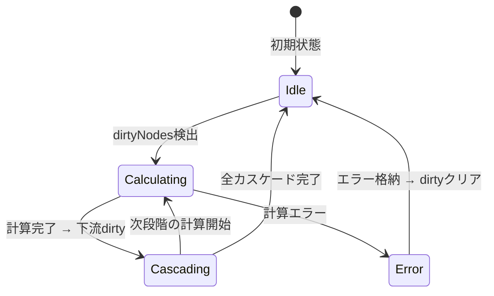
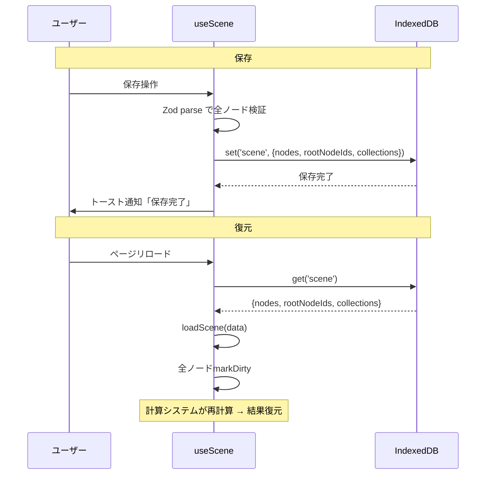

# hvac-bim-mvp データフロー図

**作成日**: 2026-03-26
**関連アーキテクチャ**: [architecture.md](architecture.md)
**関連要件定義**: [requirements.md](../../spec/hvac-bim-mvp/requirements.md)

**【信頼性レベル凡例】**:
- 🔵 **青信号**: EARS要件定義書・設計文書・ユーザヒアリングを参考にした確実なフロー
- 🟡 **黄信号**: EARS要件定義書・設計文書・ユーザヒアリングから妥当な推測によるフロー
- 🔴 **赤信号**: EARS要件定義書・設計文書・ユーザヒアリングにない推測によるフロー

---

## システム全体のデータフロー 🔵

**信頼性**: 🔵 *アーキテクチャ設計・既存実装パターンより*

```mermaid
flowchart TD
    User[ユーザー操作]
    Tools[HVAC ツール<br/>packages/editor]
    Scene[useScene ストア<br/>packages/core]
    Dirty[dirtyNodes Set]
    CalcSys[HVAC 計算システム<br/>packages/core/systems/hvac]
    Renderers[HVAC レンダラー<br/>packages/viewer]
    Registry[sceneRegistry]
    ViewerSys[ビューアシステム<br/>packages/viewer/systems/hvac]
    Canvas[3D Canvas]
    Panels[プロパティパネル<br/>packages/editor]
    IDB[(IndexedDB)]

    User -->|入力| Tools
    Tools -->|createNode/updateNode| Scene
    Scene -->|自動markDirty| Dirty
    Dirty -->|検出| CalcSys
    CalcSys -->|updateNode(calcResult)| Scene
    Scene -->|購読| Renderers
    Renderers -->|useRegistry| Registry
    Registry -->|参照| ViewerSys
    ViewerSys -->|色・太さ・ラベル更新| Canvas
    Renderers -->|描画| Canvas
    Scene -->|購読| Panels
    Scene -->|永続化| IDB
    Canvas -->|ポインタイベント| User
```

## ワンパス全体フロー 🔵

**信頼性**: 🔵 *ストーリー6.3・PRDセクション21.2より*



## 主要機能のデータフロー

### 機能1: ゾーン作成と負荷計算 🔵

**信頼性**: 🔵 *ストーリー2.1,2.2,2.3・REQ-201〜306より*



**詳細ステップ**:
1. ZoneDrawTool がグリッドイベントを購読し、ポリゴン頂点を収集
2. 面積はリアルタイムで Shoelace formula で算出（REQ-1601）
3. HvacZoneNode.parse() で Zod バリデーション、createNode() で Level の children に追加
4. PerimeterEditTool で方位別外壁面データを入力（半自動 or 手動）
5. LoadCalcSystem が dirty 検出、requestIdleCallback で非同期計算
6. 結果を calcResult に格納し dirty クリア
7. レンダラーが calcResult の変更を購読してカラー更新

### 機能2: 系統グルーピングと機器選定 🔵

**信頼性**: 🔵 *ストーリー3.1,3.2・REQ-401〜505より*



### 機能3: ダクトルーティングと風量配分 🔵

**信頼性**: 🔵 *ストーリー4.1,4.2・REQ-701〜903より*



### 機能4: 圧損計算と配管 🔵

**信頼性**: 🔵 *ストーリー4.3,5.1・REQ-1001〜1105より*



### 機能5: 警告バリデーション 🔵

**信頼性**: 🔵 *REQ-1201〜1203・PRDセクション17より*

```mermaid
flowchart TD
    VS[ValidationSystem] --> |全HVACノード走査| Checks

    subgraph Checks[バリデーションチェック]
        C1[未接続ポート検出]
        C2[風量未設定検出]
        C3[寸法未確定検出]
        C4[推奨風速超過検出]
        C5[圧損計算未実施検出]
        C6[系統未割当ゾーン検出]
        C7[風量乖離検出 ±5%]
        C8[配管未接続検出]
    end

    Checks --> Warnings[warnings: Warning[]]

    Warnings --> Badge[ノード上バッジ<br/>赤丸 + 警告数]
    Warnings --> List[左パネル警告一覧]
    Warnings --> Detail[右パネル詳細]

    List --> |クリック| Select[該当ノード選択 + ズーム]
```

## データ処理パターン

### 同期処理 🔵

**信頼性**: 🔵 *既存実装パターンより*

- **ノード CRUD**: createNode/updateNode/deleteNode は同期的に useScene を更新
- **dirty マーク**: 即座に dirtyNodes Set に追加
- **レンダラー更新**: React の再レンダリングサイクルで自動反映

### 非同期処理 🔵

**信頼性**: 🔵 *ヒアリング「dirty検出+非同期」選択より*

- **HVAC 計算**: requestIdleCallback / setTimeout(0) で UI スレッド非ブロッキング
- **カスケード計算**: 各システムの計算完了 → 下流ノード dirty マーク → 次システムが検出
- **計算進捗**: 計算中フラグを useScene に持ち、UI でインジケータ表示

### バッチ処理 🟡

**信頼性**: 🟡 *NFR-001パフォーマンス要件から妥当な推測*

- **風量一括配分**: 1系統の全ダクト区間を1回のトラバーサルで更新
- **寸法一括選定**: 風量確定後に全区間の寸法を一括計算
- **警告一括評価**: 全ノード走査を1パスで実行

## 状態管理フロー

### フロントエンド状態管理 🔵

**信頼性**: 🔵 *既存3ストアパターンより*



### HVAC 計算状態管理 🔵

**信頼性**: 🔵 *アーキテクチャ設計・PRDセクション16より*



## 保存/復元フロー 🔵

**信頼性**: 🔵 *REQ-1301,1302・ヒアリングQ9より*



## 関連文書

- **アーキテクチャ**: [architecture.md](architecture.md)
- **型定義**: [interfaces.ts](interfaces.ts)
- **ヒアリング記録**: [design-interview.md](design-interview.md)
- **要件定義**: [requirements.md](../../spec/hvac-bim-mvp/requirements.md)

## 信頼性レベルサマリー

- 🔵 青信号: 14件 (93%)
- 🟡 黄信号: 1件 (7%)
- 🔴 赤信号: 0件 (0%)

**品質評価**: 高品質
